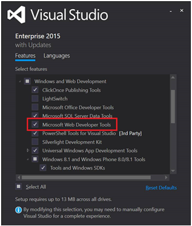
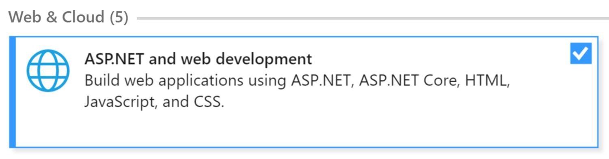

## What do I need to start this lab?
#### Visual Studio 2015 or Visual Studio 2017

If you use Visual Studio 2015 Community Edition or higher, make sure you check "__Microsoft Web Developer Tools__" in the custom installation.



If you use [Visual Studio 2017](https://www.visualstudio.com/thank-you-downloading-visual-studio/?sku=Community&rel=15) Community Edition or higher, make sure you check "__ASP.NET and web development__" in the custom installation.



Both Visual Studio Community Edition are **Free**.

#### Bot Framework Template
To create our first bot we will use a template that Bot Framework provides to make things easier for us. 
You can download the __BotApplication.zip__ I have uploaded to this module.

**How do I install my Bot Template?**
Easy peasy. Once you have downloaded the .zip file, just paste it in the Visual Studio project templates directory.
This is the route you are looking for in Visual Studio 2015: 
```
“%USERPROFILE%\Documents\Visual Studio 2015\Templates\ProjectTemplates\Visual C#\”
```
and in Visual Studio 2017 
```
“%USERPROFILE%\Documents\Visual Studio 2017\Templates\ProjectTemplates\Visual C#\”
```

After doing this you should be able to create a new **Bot Application** project.

#### Bot Framework Channel Emulator
Before we upload our Bot to the Cloud we should do some previous testing. For this, we have the  [Bot Framework Channel Emulator](https://docs.botframework.com/en-us/tools/bot-framework-emulator/). Download the emulator and install it in your computer. Later on I will guide you on how to use it.

#### Azure Account
In this lab we will use Azure to publish our bot online.
You can get your free account [here](https://azure.microsoft.com/en-us/offers/ms-azr-0044p/) to get started.

If you are a student you can get a [Microsoft Imagine](https://azure.microsoft.com/en-us/pricing/member-offers/imagine/) account.


**Once you have completed downloading and installing these prerequisites you are ready to begin!**
**Enjoy!**