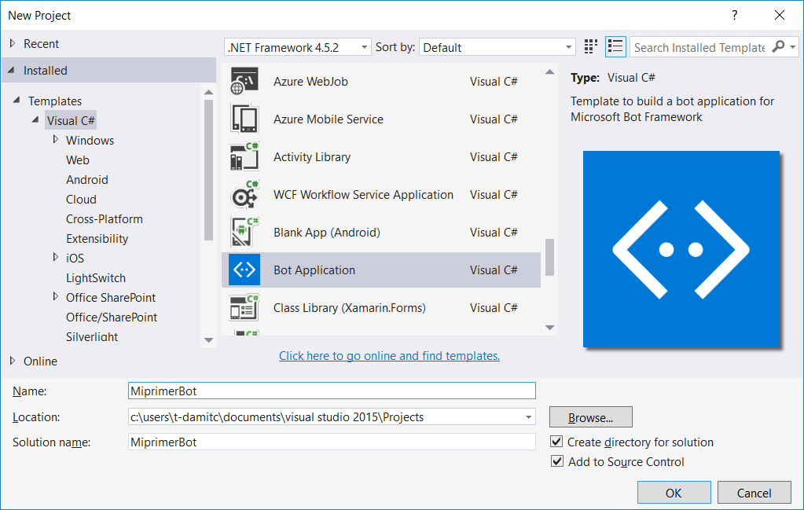
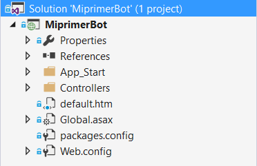

# Module 1 - Bot Framework Basics

Welcome to Module 0, in this section you will create your first bot application and learn the basic structure of the project.

:sos: Before we start, I strongly suggest you make sure you downloaded all the necesary software and files needed specified in [Module 0](https://github.com/DanyStinson/BigBotTheory/tree/master/Modules/Module-0)

The first step, as you will imagine is to **Open Visual Studio**.

After that, create a new project, select the Bot Application template. Assign your project a name and give life to your first bot! 

**Note**: Check the "Add to Source Control" option, it will help with you with version control and you will have a repository to work with.


## Project structure

Lets have a look a the projects structure to understand how our bot works.



We have: 
- A series of **properties** and **references** as we have in all our Visual Studio projects. 
- An **App_Start** folder that contains **WebApiConfig.cs** which is in charge of the routes of our Bot and Json options.
- A **Controllers** folder, it contains the controllers which will process the users actions.
- A default webpage **default.htm** which will appear when we run our project.
- A series of configuration files of the packages and WebApi.

For the moment that is all our bot needs to work. 

### **MessageController.cs**
Right now MessageController.cs is our principal class in our new project. Here is where the magic begins, specifically with the following method:

```sh
 public async Task<HttpResponseMessage> Post([FromBody]Activity activity)
        {
            if (activity.Type == ActivityTypes.Message)
            {
                ConnectorClient connector = new ConnectorClient(new Uri(activity.ServiceUrl));
                // calculate something for us to return
                int length = (activity.Text ?? string.Empty).Length;

                // return our reply to the user
                Activity reply = activity.CreateReply($"You sent {activity.Text} which was {length} characters");
                await connector.Conversations.ReplyToActivityAsync(reply);
            }
            else
            {
                HandleSystemMessage(activity);
            }
            var response = Request.CreateResponse(HttpStatusCode.OK);
            return response;
        }
``` 


The method receives an **Activity** object (also called **activity**) that is used for communication between the user and the bot. This activity can be of different types, among them is the message type, which contains information sent between the two ends of the conversation.

**Reminder**: This template consists of a bot that returns the number of characters of the message sent by the user.

If the activity that the bot receives is of type message, it will get its length, it will generate a response with the **CreateReply ()** method and it will be sent back to the user. Then you will wait for the user to send you a message again.

If the activity is not message type, it will be redirected to another function of the controller that is in charge of actions that we can predefine for the different types of activities sent to the bot.