# Publishing Our Bot

## Welcome to Module 2!

If you have completed  [Module 1](https://github.com/DanyStinson/BigBotTheory/tree/master/Modules/Module-1) you should have a working basic bot.

Here is a small resume of what this module is going to cover:

- Publish the bot as an Azure WebApp
- Register our bot in Bot Framework
- Deploy our bot in a Skype Account

### Publishing our bot in Azure 

Publishing a web application is very easy, simple and fast with Visual Studio and Microsoft Azure.

Open the Visual Studio Solution of your bot.

Next, right click in your bot project and click on "__Publish__".

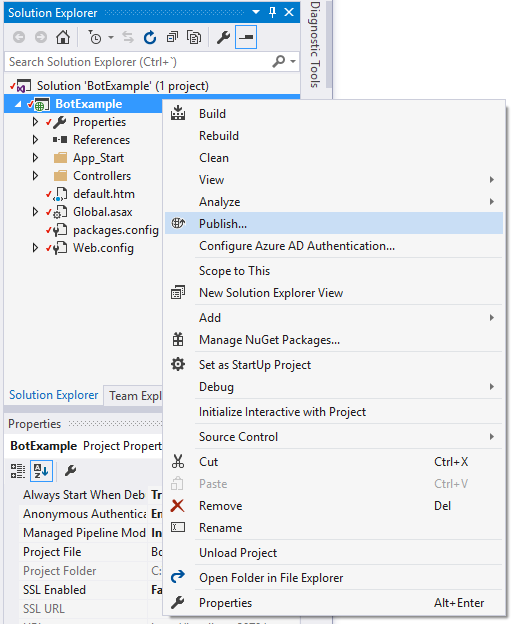

The Publish window should appear. Select __Microsoft Azure Web Apps__.

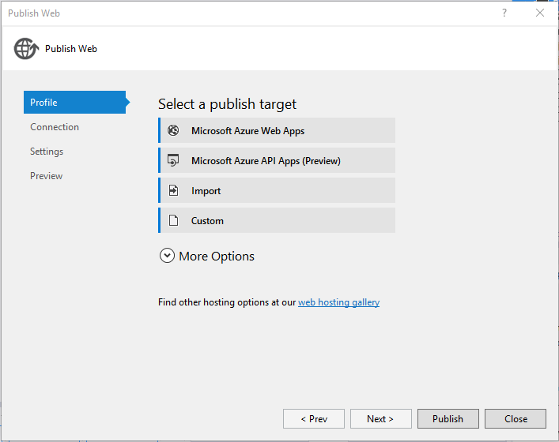

In the Microsoft Azure Web Apps window select your Subscription and create a new Web App.


Click on create and publish your Web App!!

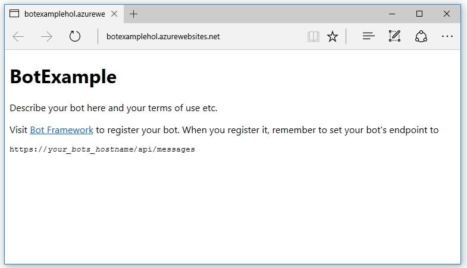


## Register our bot in Bot Framework

Now that we have our bot up and running in the cloud, we can register it at [Bot Framework](https://dev.botframework.com/).

Log in with a Microsoft account and register a new bot.

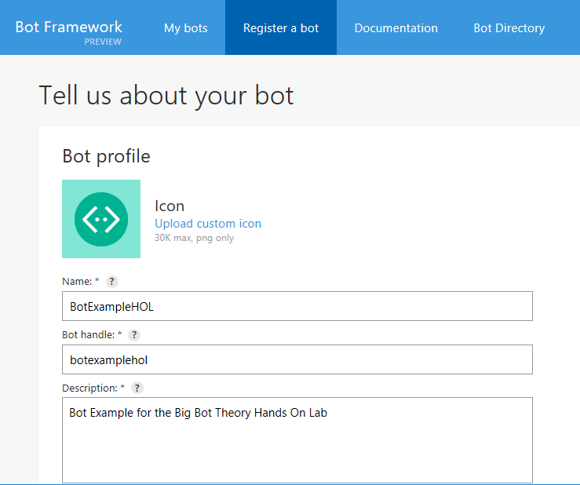

For the Messaging endpoint insert your generated Web App direction like following link:

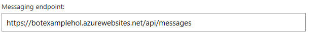

>__Note__: Don`t forget to use _https_ and to add _/api/messages_ at the end.

Next we have to generate a new App ID and password for our bot. If you press the link, a new tab will open with our App ID.

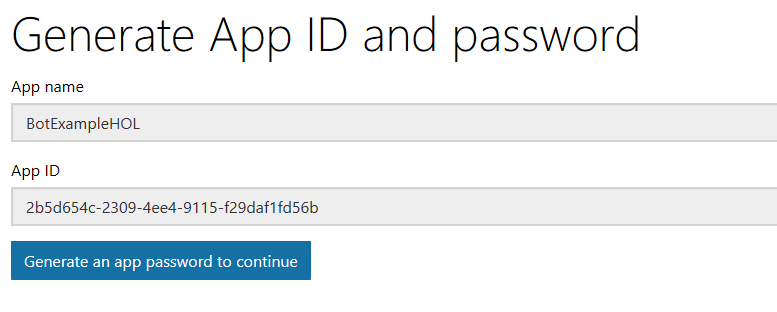

Go to the Web.Release.config file of your project.

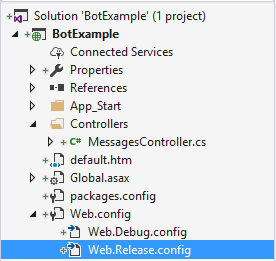

 Now place the following code inside the < configuration > tag and paste your __App Id__ in the __MicrosoftAppId__ key.

```
  <appSettings>
    <add key="MicrosoftAppId" value="Put your id here" xdt:Transform="SetAttributes" xdt:Locator="Match(key)" />
    <add key="MicrosoftAppPassword" value="Put your password here" xdt:Transform="SetAttributes" xdt:Locator="Match(key)" />
  </appSettings>
```

Go ahead and generate your password and paste it in the __MicrosoftAppPassword__ key in the __Web.Release.config__ file.

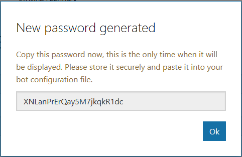

When you finish the process you will get redirected back to the Bot Registration page. The app ID should already appear in it´s input.

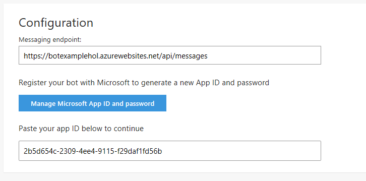

Go ahead and __Confirm__ the registration.

#### __Updating the bot__

Right now, you should have registered your bot and have a homepage like this one:

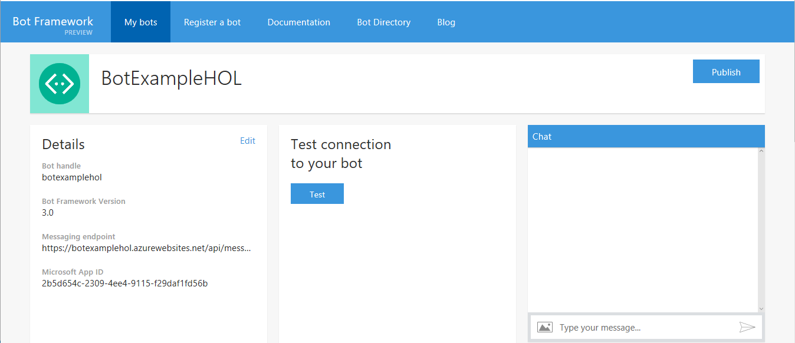

If you test your connection it won´t work, because the bot we published didn´t include the __App__ and __Password__ keys for the bot.

Go back to your project in Visual Studio and re-publish your new code to Azure.

Right click in your bot project and click on "__Publish__".


Then press the publish button!

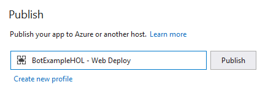

If you go back to the Bot Framework page and Test your connection again it should succeed.

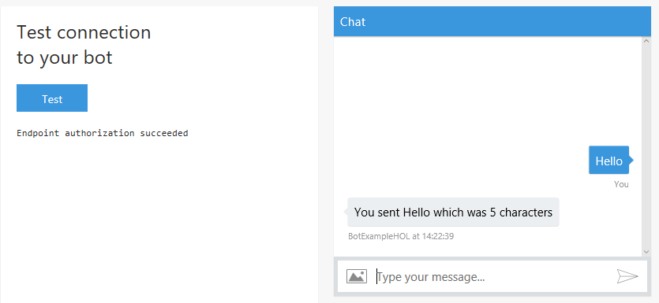

Now we are ready to register our bot in different channels!

## Register our bot in Skype
Bot Framework has already registered our bot in Skype! The only thing you have to do is add it to your contacts. If you go to the __Channels__ section in the Bot Framework page, click on the __Add to Skype__ button and it will redirect you to another tab to add your bot to your contact list.

 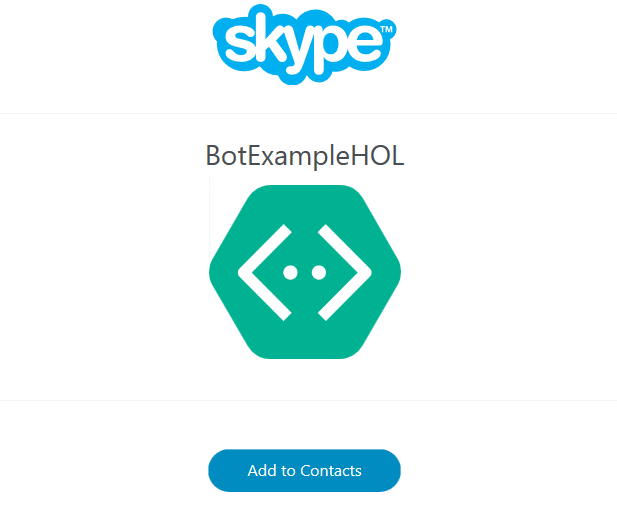

 When you log into your Skype account with __[Skype](https://www.skype.com/en)__ or __[Skype Preview for Windows 10](https://www.microsoft.com/en-us/store/p/skype-preview/9wzdncrfj364)__ your bot will be there and you can talk to it just as you would do with another contact.

## Embed your bot in websites 

Bot Framework also registers our bot in the Web Chat Channel. A Web Chat is a web control that we can embed in any website to talk with our bot.

To obtain the < iframe > go __Get bot embed codes__ link in the __Channels__ Section, select the Web Chat icon and press the link that will appear.

Next insert a simple name to reference your site.
 
 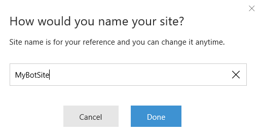

And the next screen will give you the < iframe > code and two keys you can use for the Web Chat link to work. Remember to save your configuration once you are done.

 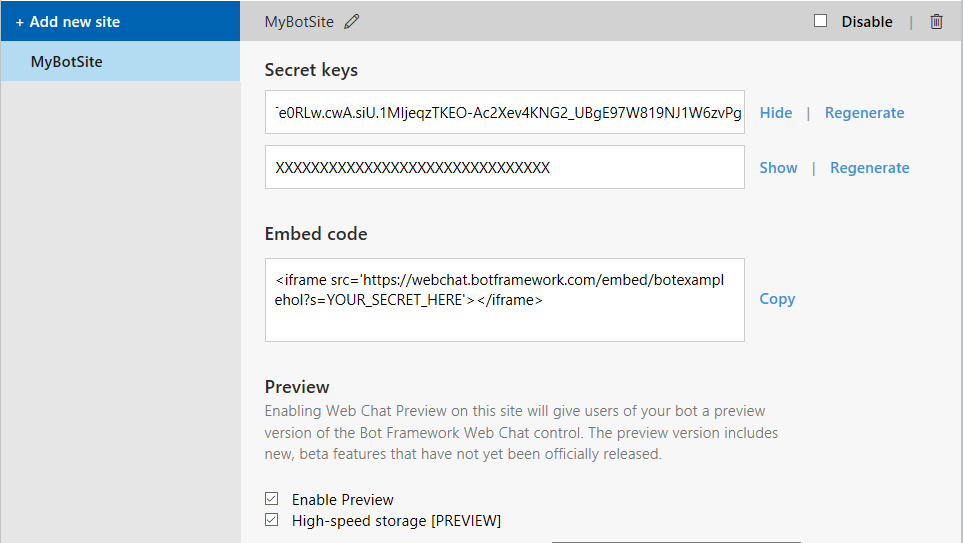

>__Note__: You only have to place one of the keys in the < iframe >.

Now you can place your bot in any webpage!!

## That&#39;s the end for Module 2.

Let´s recap a little.

In this module, you have learned: 

- How to publish your bot as an Azure WebApp
- Register your bot in the Bot Framework
- Deploy your bot to Skype
- Deploy your bot as a Web Chat

Continue to  [Module 3](https://github.com/DanyStinson/BigBotTheory/tree/master/Modules/Module-3) to learn how to add dialogs to your bot!

