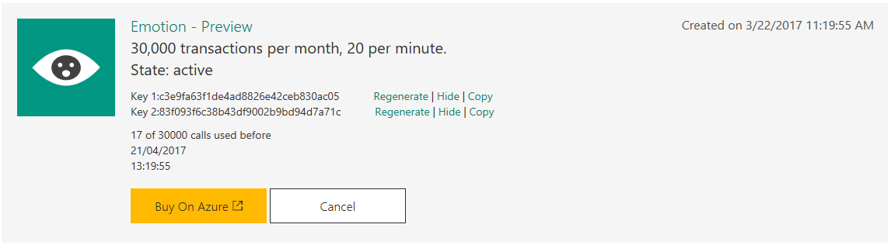
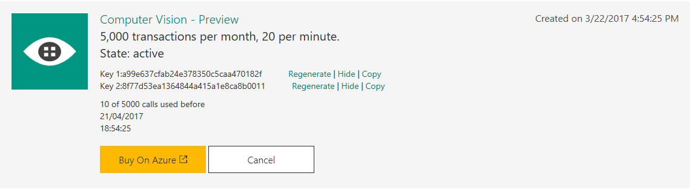
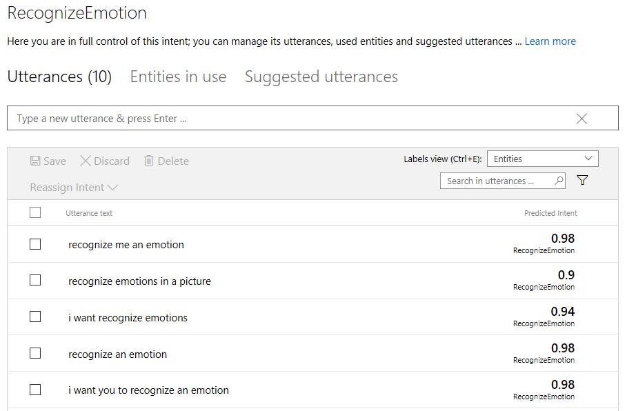
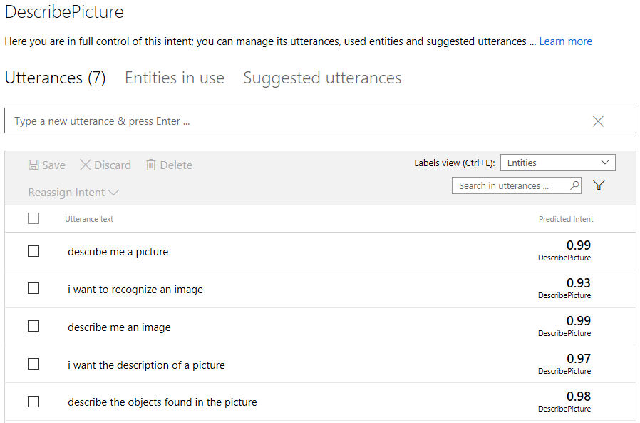

# Adding Vision Cognitive Services To Our Bot
## Welcome to Module 5

If you have completed [Module 1](https://github.com/DanyStinson/BigBotTheory/tree/master/Modules/Module-1), [Module 2](https://github.com/DanyStinson/BigBotTheory/tree/master/Modules/Module-2), [Module 3](https://github.com/DanyStinson/BigBotTheory/tree/master/Modules/Module-3) and [Module 4](https://github.com/DanyStinson/BigBotTheory/tree/master/Modules/Module-4)
you should have a working bot, with a normal dialog and a LUIS Dialog that asks the user whether he wants to know about your bot´s friends or what plan does it recommend for a specific day of the week.

If you have followed the three modules you can still use the same bot, if you are starting from this module, you can download the solution I have left in the __Start__ folder of this module.
>__Note:__ If you download the Start folder remember to populate the dictionaries located in the __BigBangTheoryClient.cs__ file inside the __Model__ folder. You also have to link your LUIS service to your bot adding the keys in the __Web.config__ file.

Here is a small resume of what this module is going to cover:
- Usage of Microsoft Computer Vision API.
- Usage of Microsoft Emotion API.
- Bind the API`s with our LUIS service.

## Microsoft Cognitive Services
Microsoft Cognitive Services (formerly Project Oxford) are a set of APIs, SDKs and services available to developers to make their applications more intelligent, engaging and discoverable. Microsoft Cognitive Services expands on Microsoft’s evolving portfolio of machine learning APIs and enables developers to easily add intelligent features – such as emotion and video detection; facial, speech and vision recognition; and speech and language understanding (We have already used LUIS) – into their applications.

In this Hands On Lab, we are going to use the __Computer Vision__ and __Emotion__ API`s.

In order to use these services we have to download it´s correspondants __Nugget Packages__.

Here are the links to [Emotion](https://www.nuget.org/packages/Microsoft.ProjectOxford.Emotion/) and [Vision](https://www.nuget.org/packages/Microsoft.ProjectOxford.Vision/) 
nuget packages and installation steps.

### Emotion Service

To use the Emotion Service let´s create a new service class:

- Create a new __Services Folder__ in your project.
- Create an __EmotionService.cs__ class in the __Services Folder__

#### __Emotion API Key__
To use the Emotion API you need to get an Endpoint key. You can get your key for free at the [Microsoft Cognitive Services Web](https://www.microsoft.com/cognitive-services/en-us/emotion-api).



Once you have your key, store it in the Web.config file with the rest of the keys inside the < appSettings> tag:

```
<add key="EmotionAPIKey" value="Put your key here"/>
```
Now we are ready to link our bot to the Emotion API through a client. Add the following code to the EmotionService class:

```
private static readonly string ApiKey = ConfigurationManager.AppSettings["EmotionAPIKey"];
private EmotionServiceClient client = new EmotionServiceClient(ApiKey);
```

#### __Emotions Dictionary__

The Emotion Service Client is going to return us a list of emotions found in the picture we send it. When we send the reply to the user we normally describe what we detected in the picture, so let´s create an adjectives Dictionary to make this task easier.

Add the following code to the EmotionService class:

```
private static Dictionary<string, string> adjectives = new Dictionary<string, string>()
{
    { "Anger", "angry" },
    { "Contempt", "contemptuous" },
    { "Disgust", "disgusted" },
    { "Fear", "scared" },
    { "Happiness", "happy" },
    { "Neutral", "neutral" },
    { "Sadness", "sad" },
    { "Surprise", "surprised" }
};
```

#### __Get the emotion__

Once we have our Emotions client and Adjectives Dictionary we are ready to analyze the image and send a reply to the user. 

Let´s begin by creating the GetEmotionsAsync method:

```
public async Task<string> GetEmotionsAsync(Uri uri)
{
    var stream = await new HttpService().GetStreamAsync(uri);
    var result = await client.RecognizeAsync(stream);

    var emotions = result.Select(e => adjectives[e.Scores.ToRankedList().First().Key]);

    var count = emotions.Count();
}
```

What we are doing here is sending the Url of the image to the Emotion Service through the client we created and storing the result in a variable. Next we iterate over all the emotions received and transform their value to adjectives thanks to LINQ and the dictionary. Finally we count the emotions in order to create the reply with our results.

As you can see, our client needs a stream of the image the user wants to analyze. We need to create a Http Service to download the image from the Uri and obtain the stream.

To do this: 
- Create a new __HttpService.cs__ class in the Services Folder. 
- Add the following code:
```
public class HttpService
    {
        public async Task<Stream> GetStreamAsync(Uri uri)
        {
            var httpClient = new HttpClient();

            // The Skype attachment URLs are secured by JwtToken,
            // you should set the JwtToken of your bot as the authorization header for the GET request 
            // your bot initiates to fetch the image.
            // https://github.com/Microsoft/BotBuilder/issues/662
            if (uri.Host.EndsWith("skype.com") && uri.Scheme == "https")
            {
                var token = await new MicrosoftAppCredentials().GetTokenAsync();
                httpClient.DefaultRequestHeaders.Authorization = new AuthenticationHeaderValue("Bearer", token);
                httpClient.DefaultRequestHeaders.Accept.Add(new MediaTypeWithQualityHeaderValue("application/octet-stream"));
            }

            return await httpClient.GetStreamAsync(uri);
        }
    }
```


Include the following code after the count variable to create our response:

```
switch (count)
            {
                case 0:
                    return "I couldn't find a single person in the image";
                case 1:
                    return $"I see one person in the image looking {emotions.First()}";
                default:
                    var builder = new StringBuilder($"I see {count} people in the image and they look: ");
                    for (int i = 0; i < count; i++)
                    {
                        if (i == count - 1)
                        {
                            builder.Append(" & ");
                        }
                        else if (i != 0)
                        {
                            builder.Append(", ");
                        }
                        builder.Append(emotions.ElementAt(i));
                    }
                    return builder.ToString();
            }
```
We have completed the Emotion service. Everytime we send an image url to the GetEmotionsAsync, we will get a string back informing us if any faces have been found in the image, and if so, what emotions have been detected.

### Computer Vision Service

To use the Computer Vision let´s create a new __VisionService.cs__ class in the __Services Folder__:


#### __Computer Vision API Key__

To use the Computer Vision API you need to get an Endpoint key. You can get your key for free at the [Microsoft Cognitive Services Web](https://www.microsoft.com/cognitive-services/en-us/computer-vision-api).



Once you have your key, store it in the Web.config file with the rest of the keys inside the < appSettings> tag:

```
<add key="ComputerVisionAPIKey" value="Put your key here"/>
```
Now we are ready to link our bot to the Computer Vision API through a client. Add the following code to the VisionService class:

```
private static readonly string ApiKey = ConfigurationManager.AppSettings["ComputerVisionAPIKey"];
private VisionServiceClient client = new VisionServiceClient(ApiKey);
```


#### __Get the description__
Once we have our Computer Vision Client we are ready to analyze the image and send a reply to the user. Let´s begin by creating the GetDescriptionAsync method:

```
public async Task<string> GetDescriptionAsync(Uri uri)
{
    var stream = await new HttpService().GetStreamAsync(uri);

    VisualFeature[] visualFeatures = new VisualFeature[] 
    {
        VisualFeature.Adult,        //recognize adult content
        VisualFeature.Description   //generate image caption
    };

    var result = await client.AnalyzeImageAsync(stream, visualFeatures);

}
```
When we send an image to the Computer Vision API, we can request the service to return us the specific information we need of the analysis results, these are called VisualFeatures. Here is a list with all the Visual Features available:

- __Categories__ - categorizes image content according to a taxonomy defined in documentation. 
- __Tags__ - tags the image with a detailed list of words related to the image content. 
- __Description__ - describes the image content with a complete English sentence. 
- __Faces__ - detects if faces are present. If present, generate coordinates, gender and age.
- __ImageType__ - detects if image is clipart or a line drawing.
- __Color__ - determines the accent color, dominant color, and whether an image is black&white.
- __Adult__ - detects if the image is pornographic in nature (depicts nudity or a sex act). Sexually suggestive content is also detected.

In this occasion, we are going to retreive the description of the image, and detect whether it contains any adult content. When we receive the result from the service we are ready to create the reply to the user:

```
if (result.Adult.IsAdultContent)
            {
                return "I don't like images with adult content!";
            }
            else
            {
                var description = result?.Description?.Captions.FirstOrDefault()?.Text;

                return !string.IsNullOrEmpty(description) ?
                    $"I see the following: {description}" : "Couldn't find a description for it";
            }
```
We have completed the Computer Vision service. Everytime we send an image url to the GetDescriptionAsync, we will get a string back with the images description, and if it contains any adult content.


### Image Processing

We have created our services so we are ready to create the function to process the image depending on the users request.

#### Processing Choice

Let´s create an ProcessingChoice enumerable in __MyFirstLuisDialog.cs__ that contains the differents requests:

```
private enum ProcessingChoice { Emotions, Description }
```

#### Processing the request

Once we have our ProcessingChoice enum we can handle the users request with the following function:

```
private async Task ProcessImageAsync(IDialogContext context, IAwaitable<IMessageActivity> argument, ProcessingChoice choice)
        {
            var activity = await argument;
            Uri uri = null;

            if (activity.Attachments?.Any() == true)
            {
                uri = new Uri(activity.Attachments[0].ContentUrl);
            }
            else
            {
                uri = new Uri(activity.Text);
            }

            try
            {
                string reply = string.Empty;
                switch (choice)
                {
                    case ProcessingChoice.Description:
                        reply = await new VisionService().GetDescriptionAsync(uri);
                        break;
                    case ProcessingChoice.Emotions:
                        reply = await new EmotionService().GetEmotionsAsync(uri);
                        break;
                }
                await context.PostAsync(reply);
            }
            catch (Exception)
            {
                await context.PostAsync("Something went wrong while analyzing the image!");
            }

            context.Wait(MessageReceived);
        }
```

Let´s see what we are doing here. 

In the first part we receive the activity sent by the user. If the activity contains an attachment, we have to check if it is an image file or a url link, to create a new Uri object.

```
var activity = await argument;
Uri uri = null;

if (activity.Attachments?.Any() == true)
{
    uri = new Uri(activity.Attachments[0].ContentUrl);
}
else
{
    uri = new Uri(activity.Text);
}
```

Next we send the Uri to the requested service, send a reply to the user with the results and finally wait for the next message.

```
try
{
    string reply = string.Empty;
    switch (choice)
    {
        case ProcessingChoice.Description:
            reply = await new VisionService().GetDescriptionAsync(uri);
            break;
        case ProcessingChoice.Emotions:
            reply = await new EmotionService().GetEmotionsAsync(uri);
            break;
    }
    await context.PostAsync(reply);
}
catch (Exception)
{
    await context.PostAsync("Something went wrong while analyzing the image!");
}

context.Wait(MessageReceived);

```


Let´s add some LUIS intents to let the bot know what the user wants to do!

### Adding LUIS 

Before we include our LUIS Intent functions you have to create them in your LUIS service like we did in [Module 4](https://github.com/DanyStinson/BigBotTheory/tree/master/Modules/Module-4) and train it. Here are some examples of utterances for each intent.





#### __Recognize Emotion__
Add the following code to __MyFirstLuisDialog.cs__ to let the bot know the user wants to recognize the emotions in an image:
```
[LuisIntent("RecognizeEmotion")]
public async Task Emotion(IDialogContext context, LuisResult result)
{
    await context.PostAsync($"Send me a picture please");
    context.Wait((c, a) => ProcessImageAsync(c, a, ProcessingChoice.Emotions));
}
```

#### __Describe Picture__
Add the following code to __MyFirstLuisDialog.cs__ to let the bot know the user wants to get the description of an image:
```
[LuisIntent("DescribePicture")]
public async Task Description(IDialogContext context, LuisResult result)
{
    await context.PostAsync($"Send me a picture please");
    context.Wait((c, a) => ProcessImageAsync(c, a, ProcessingChoice.Description));
}
```
Now our bot can __recognize emotions__ and __describe pictures__ remember to update it in the __Welcome__ and __None__ intents!!

```
await context.PostAsync("I can talk about my friends, weekly night plans, recognize pictures or emotions, what would you like to me to do?");
```

### __Go ahead and ask your bot to describe you an image!__

## That&#39;s the end for Module 5.

Let´s recap a little.

In this module, you have learned the __basics of Microsoft Vision APIs__. You can now create bots that:

- Receive attachments.
- Describe the contents of an image.
- Describe the emotions found in an image.

